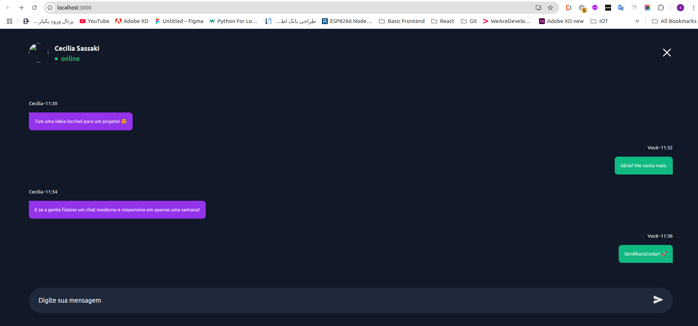

# React TypeScript Mock Data App

This project is my **second internship project** at *Esfahan Ahan Company* and also my **first React project using TypeScript**.

## 📌 Purpose

The main goal of this project was to practice and learn the following concepts:

- 🧩 **Component-based architecture** in React
- ✅ **Type safety** and type management with **TypeScript**
- 🔗 **Fetching mock data** using [`json-server`](https://github.com/typicode/json-server)

## ⚙️ Technologies Used

- React
- TypeScript
- CSS Modules / Tailwind (if used, update here)
- json-server (for mock API)

## 🚀 How to Run

1. Clone the repo:
   ```bash
   git clone https://github.com/SadafAmiiniii/chats.git
   cd chats
   
2. Install dependencies:
      ```bash
      npm install
3. Start the mock server:
      ```bash
      npx json-server --watch db.json --port 4000
4. Start the development server:
      ```bash
      npm run dev

## 📸 Preview


